# 氛围编程指南（OpenCode）
前一章节介绍了[使用Claude Code进行氛围编程的基本概念和方法](./readme.md)。在本章里将介绍使用[OpenCode](https://github.com/anomalyco/opencode)的基本使用方法和一些最佳实践。

> OpenCode是一个开源的代码Agent，类似Claude Code，天然支持各种中美大模型（也提供免费模型额度），并且支持sub-agent并行，可以让你更高效地完成复杂的编程任务。非常适合动手能力强且有个性化需求的开发者。比如参考[OpenClaw](https://github.com/openclaw/openclaw)给OpenCode增加个性化，自我进化等高级能力。大部分Claude Code社区里的Skill也都支持OpenCode，所以迁移成本很低。

## 目录
- [氛围编程指南（OpenCode）](#氛围编程指南opencode)
  - [目录](#目录)
  - [安装和配置](#安装和配置)
    - [安装OpenCode](#安装opencode)
    - [配置模型](#配置模型)
    - [配置Skill](#配置skill)
  - [常用指令](#常用指令)
  - [项目实践](#项目实践)
    - [AI科技周报自动生成](#ai科技周报自动生成)
    - [Nano-vLLM添加预填充解码分离功能](#nano-vllm添加预填充解码分离功能)
      - [工作流](#工作流)
      - [开发环境准备](#开发环境准备)
      - [解析Nano-vLLM](#解析nano-vllm)
      - [创建和迭代修改计划](#创建和迭代修改计划)
      - [按照修改计划修改代码](#按照修改计划修改代码)

## 安装和配置

### 安装OpenCode

```bash
curl -fsSL https://opencode.ai/install | bash
```

### 配置模型

```bash
opencode # 启动OpenCode
/connect # 设置模型，这里可以选iFlow（免费模型），需要粘贴iFlow的API KEY
/model # 切换模型，这里可以选OpenCode提供的免费模型，比如MiniMax M2.5 Free
```
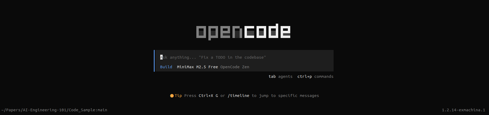
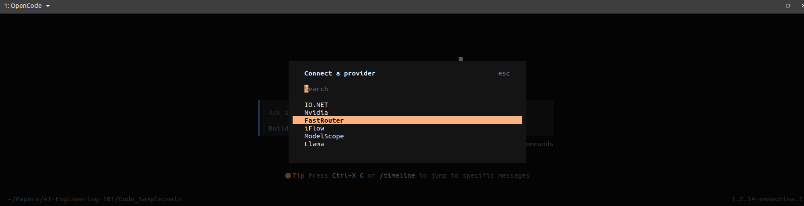

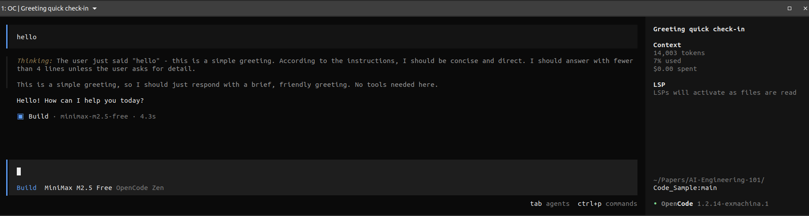

### 配置Skill
这里安装的Skill是[Superpowers](https://github.com/obra/superpowers)，它是一个非常强大的软件开发流程自动化Skill，包含了需求分析，系统设计，代码实现，测试验证，文档更新等多个步骤，可以极大提升软件开发效率。

```bash
# 安装Superpowers Skill
Fetch and follow instructions from https://raw.githubusercontent.com/obra/superpowers/refs/heads/main/.opencode/INSTALL.md 
```
安装好后，可以在`OpenCode`里通过`/skills`查看已经安装好的`Skills`。
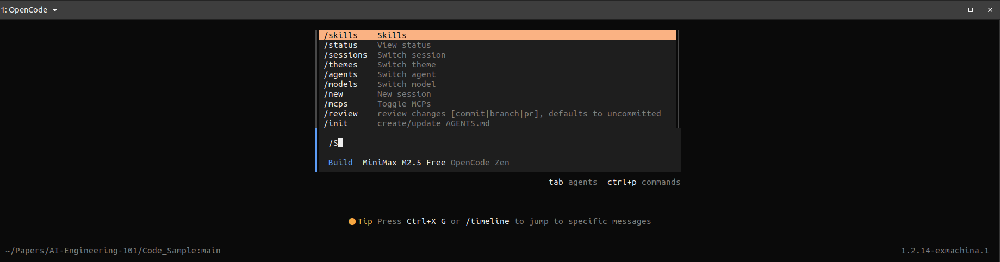


## 常用指令
这里列出一些常用指令，方便大家快速上手。

|指令|唤醒|功能描述|
|:---:|:---:|:---:|
|init|`/init`|生成项目的精简文档|
|`<tab>`|`<tab>`|切换`Plan`和`Build`模式|
|model|`/model`|切换模型|
|skills|`/skills`|查看已安装的Skill并选择应用的Skill|
|exit|`/exit`|退出OpenCode|
|clear|`/clear`|清理上下文，如果上下文已经达到256K，需要清理|
|share|`/share`|分享当前session的上下文（团队协作）|
|undo|`/undo`|撤销上一步操作|


## 项目实践

### AI科技周报自动生成
_制作一个自动化采集AI资讯的工作流，可以通过`AI科技周报`一键唤醒，自动整理成HTML文件_

激活`writing-skills`
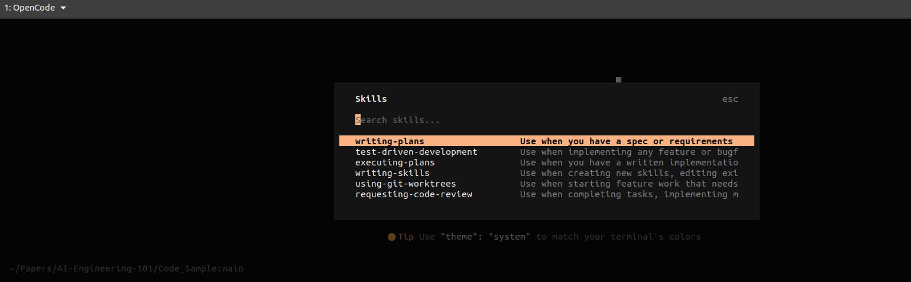

提示词（可以自行修改）
```markdown
帮我生成一个Skill，下面是详细名称(如果已经存在这个skill，请帮我删除重新建)
  
Skill名称：Jason-AI-Weekly（AI科技周报）                                                                                                            核心功能
帮你精选每周最值得关注的AI行业资讯，让你用最少的时间掌握最新的行业动态。

具体需求

1. 精选资讯抓取
- 收集近一周的AI资讯新闻
- 覆盖权威AI科技媒体（TechCrunch，The Verge, Hacker News等）
- 覆盖一线科技公司的技术博客（Microsoft，Meta，Google，Apple，Amazon，OpenAI，Anthropic，xAI，AnyScale）
- 覆盖主流科研平台（HuggingFace Daily Paper，arXiv）
- 尽可能通过主题过滤，主题偏好设置成agent相关，特别是agent serving/infra/hareness/platform，只保留最有价值的行业资讯
- 抓取流程应该遵循先爬虫主页，再通过日期和关键词等过滤，找到具体的资讯新闻，不能无中生有

2. 智能摘要生成
- 把抓取的内容转化为中文精华版
- 每条资讯提炼出50-100字核心要点
- 要能标注关键词标签，方便快速定位感兴趣的内容

3. 清爽界面展示
- 导出精美的可视化HTML界面
- 头部显示：【Jason AI 周报（日期）】
- 采用卡片式设计，每条资讯一目了然
- 点击卡片即可直接查看原文详情

4. 一键触发
- 发送【AI科技周报】即可启动
- 实时生成当前周的精选AI资讯合集

备注（这里主要是资讯的主页网站）
1. Microsoft技术博客网站 https://www.microsoft.com/en-us/research/blog/
2. Meta技术博客网站 https://ai.meta.com/blog
3. Google技术博客网站 https://ai.googleblog.com/
4. Apple技术博客网站 https://machinelearning.apple.com/
5. Amazon技术博客网站 https://www.amazon.science/blog
6. OpenAI技术博客网站 https://openai.com/news/research/
7. Anthropic技术博客网站 https://www.anthropic.com/research
8. xAI技术博客网站 https://x.ai/news
9. AnyScale技术博客网站 https://www.anyscale.com/blog
10. HuggingFace Daily Paper https://huggingface.co/papers/date/{yyyy-mm-dd}
11. arXiv paper检索可以使用 arXiv-mcp-server https://github.com/blazickjp/arxiv-mcp-server
```
在markdown文件里改好之后，可以直接粘贴到OpenCode里，如下图

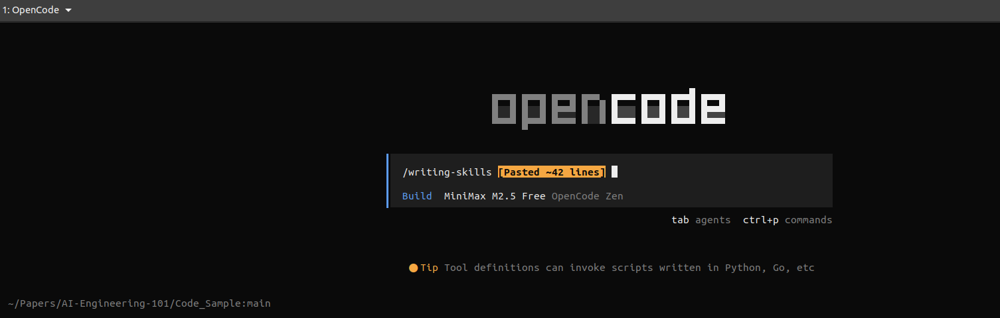

当创建好Skill之后，就可以直接在OpenCode里通过`AI科技周报`唤醒，自动生成精选AI资讯合集。
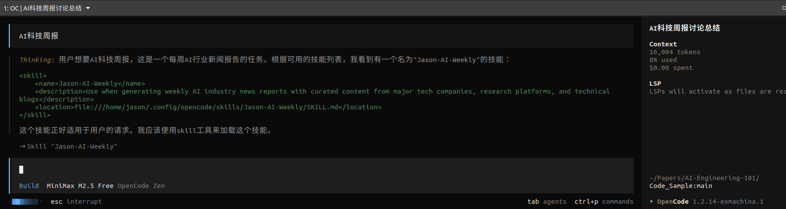
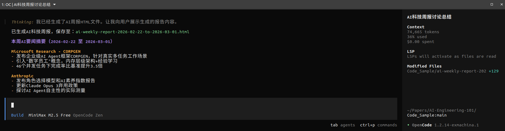

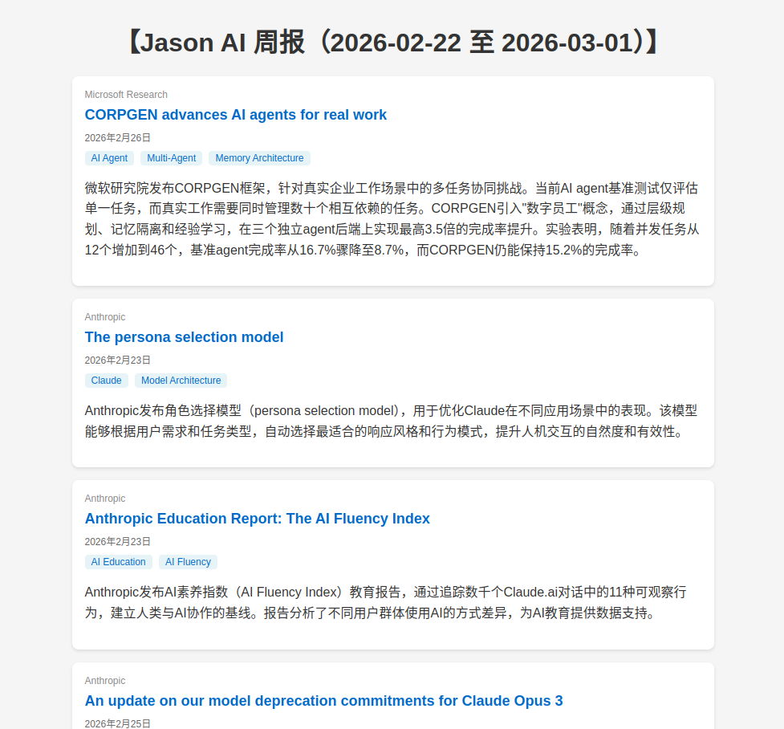

### Nano-vLLM添加预填充解码分离功能
_给Nano-vLLM添加一个prefill decode disaggregation功能_

#### 工作流
这里采取的是`Superpowers`工作流

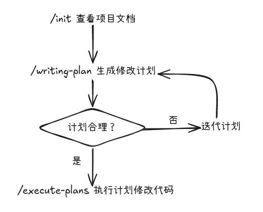

#### 开发环境准备
下载Nano-vLLM项目，并进入项目目录
```bash
git clone https://github.com/GeeeekExplorer/nano-vllm.git # 下载项目
cd nano-vllm # 进入项目目录
uv venv # 创建虚拟环境
source venv/bin/activate # 激活虚拟环境
```
#### 解析Nano-vLLM
启动OpenCode，并通过`/init`命令解析项目，生成一个精简文档，快速理解项目的运行和核心架构。
```bash
/init # 生成项目文档
```
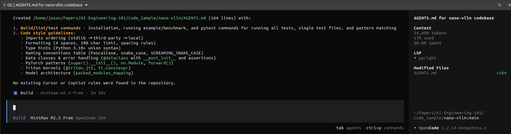
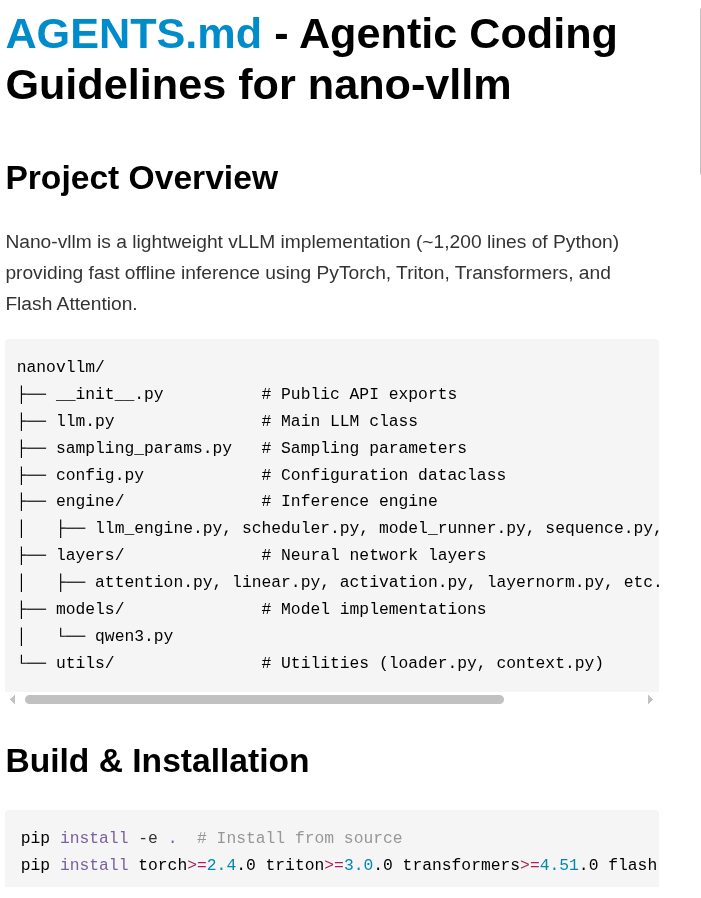

#### 创建和迭代修改计划
调用`Skills`里的`writing-plans`，根据需求，生成一个修改计划，并确认计划是否正确。`writing-plans`会自动调用`superpowers`里的预置工作流，生成一个修改计划。

```bash
/writing-plans 我需要给Nano-vLLM添加一个prefill decode disaggregation功能，首先帮我分析一下这个功能的实现思路和写一个大致的修改计划。
```
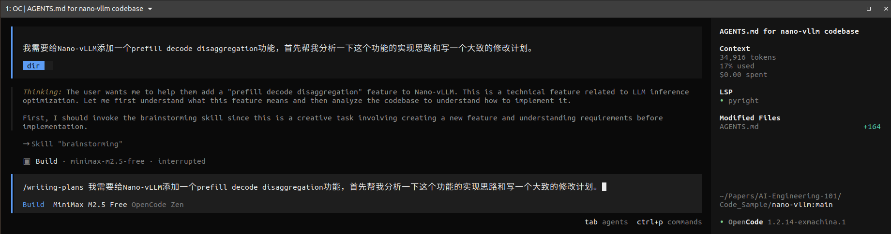

调用`writing-plans`生成计划里，OpenCode会反复和你确定实现需求，并且会根据需求自动迭代修改计划，直到计划正确。
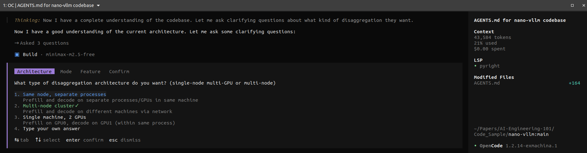
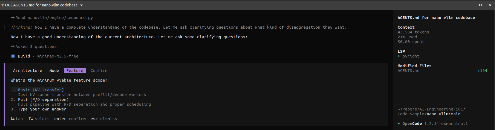
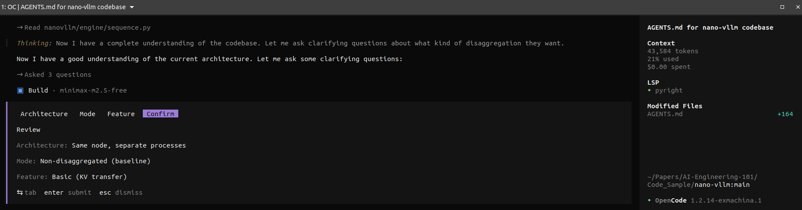
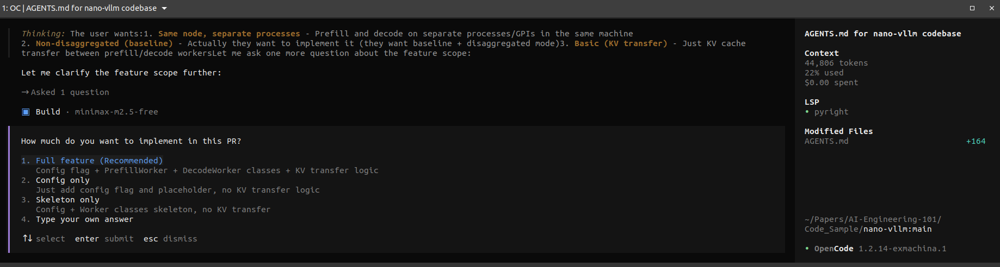
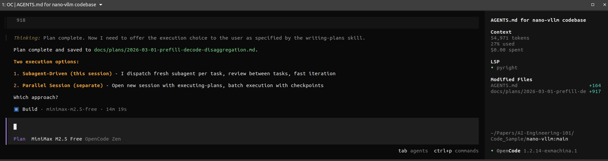
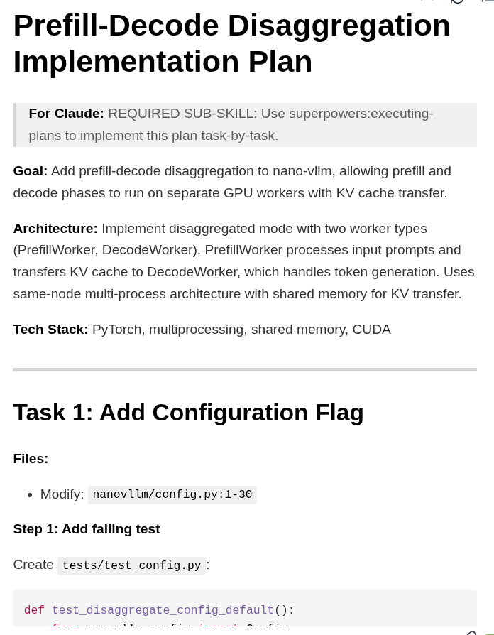

迭代修改计划，直到计划正确。
```bash
在计划里添加一个Monitor功能，能够监控prefill decode disaggregation的运行状态和性能指标，帮助我们更好地调试和优化这个功能。
```
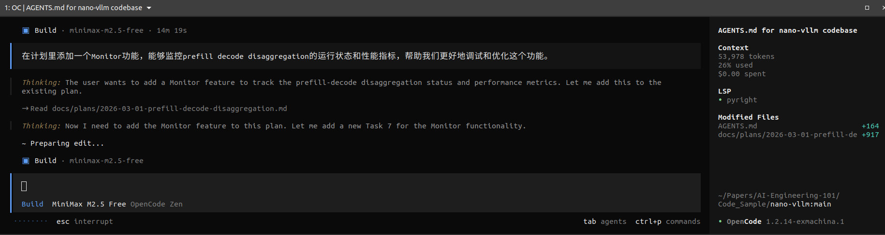
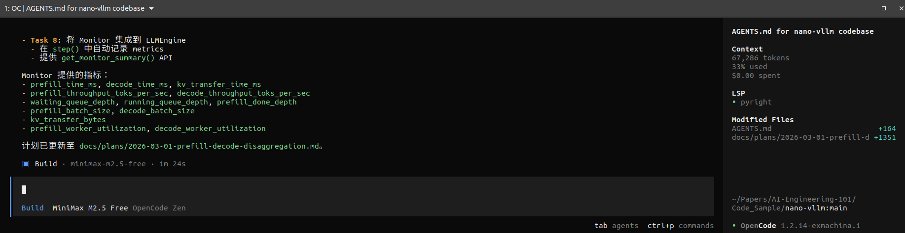
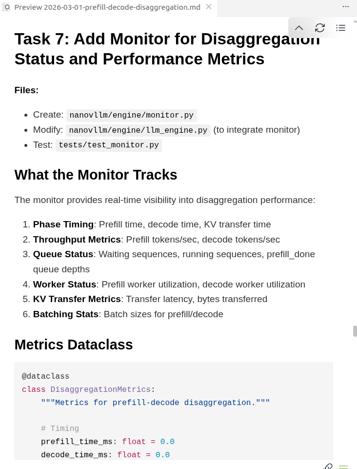

#### 按照修改计划修改代码
切换到`Build`模式，根据计划修改代码。
```bash
/executing-plans 按照@docs/plans/2026-03-01-prefill-decode-disaggregation.md 实现修改计划
```
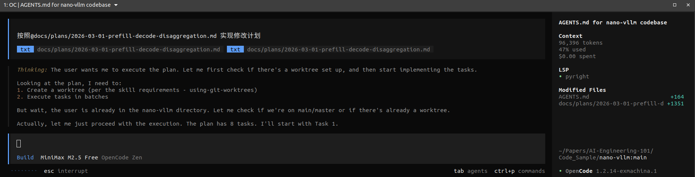

执行过程里，可以看到OpenCode依据计划，设置了TODO标记，并且在每个步骤里都进行了代码修改。
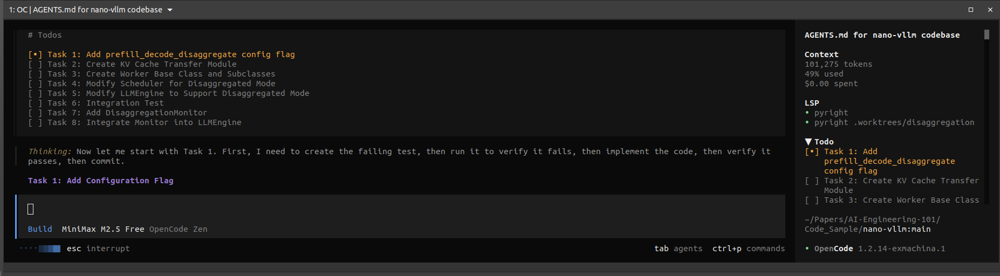
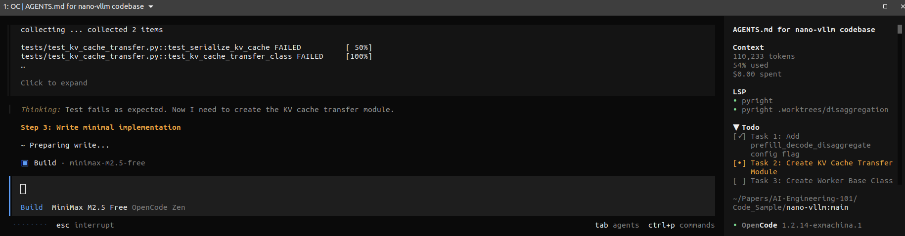
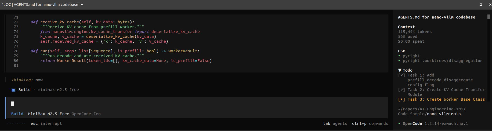
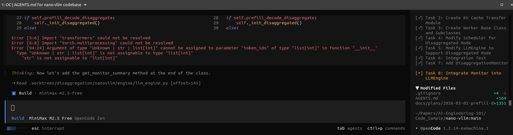
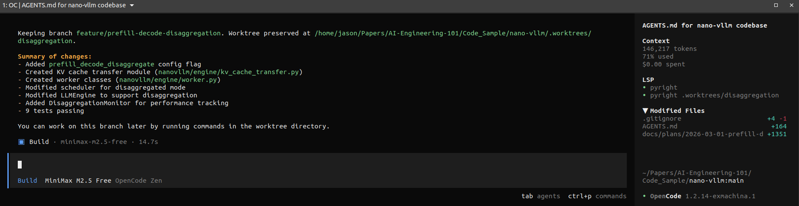
