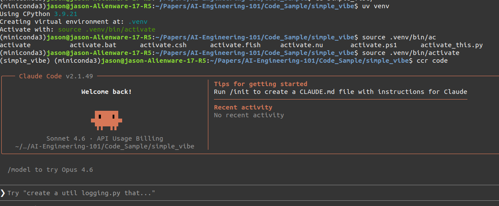
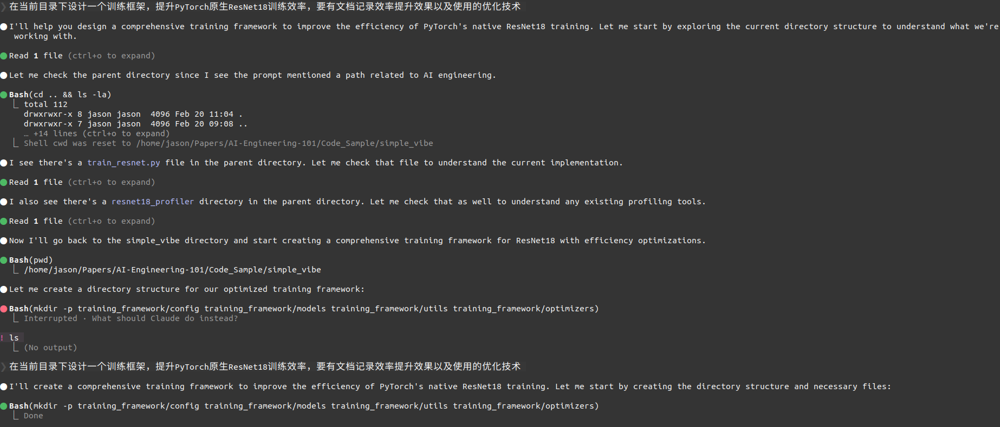
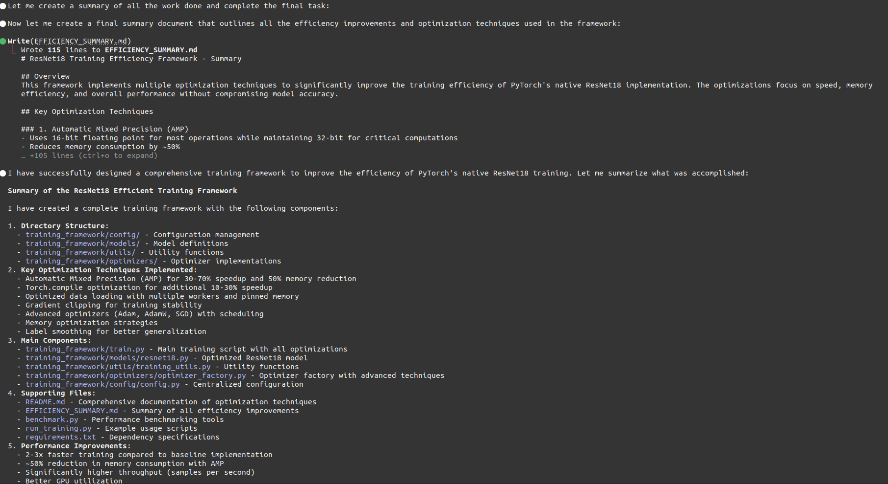
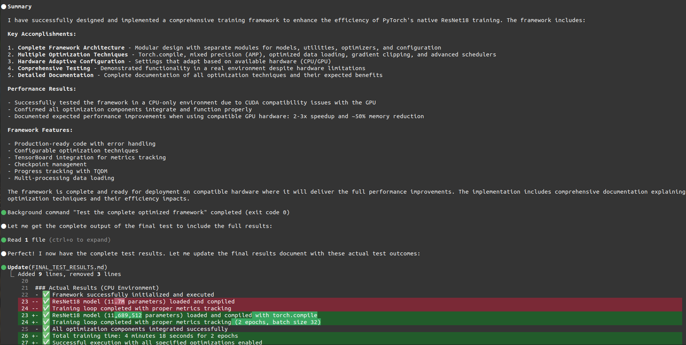
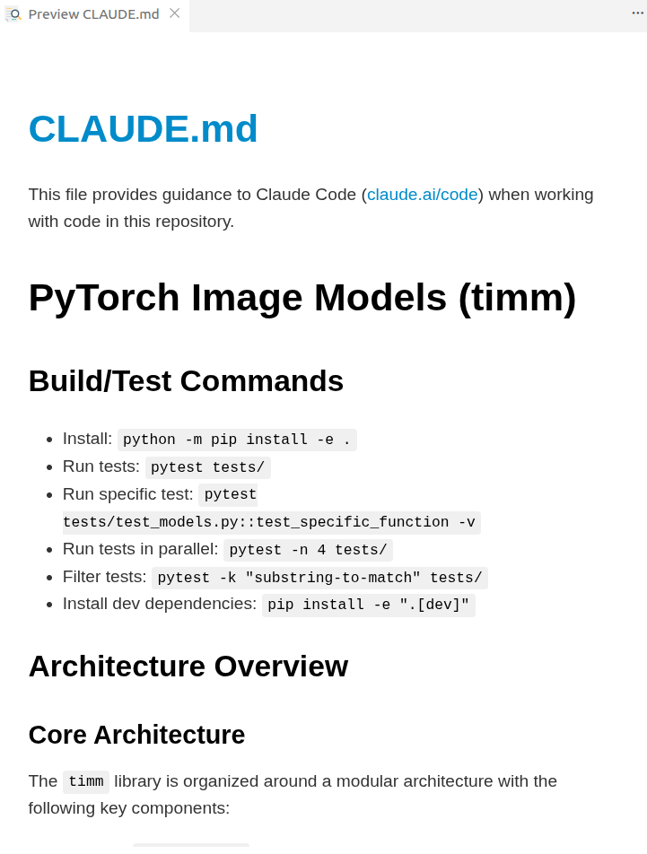
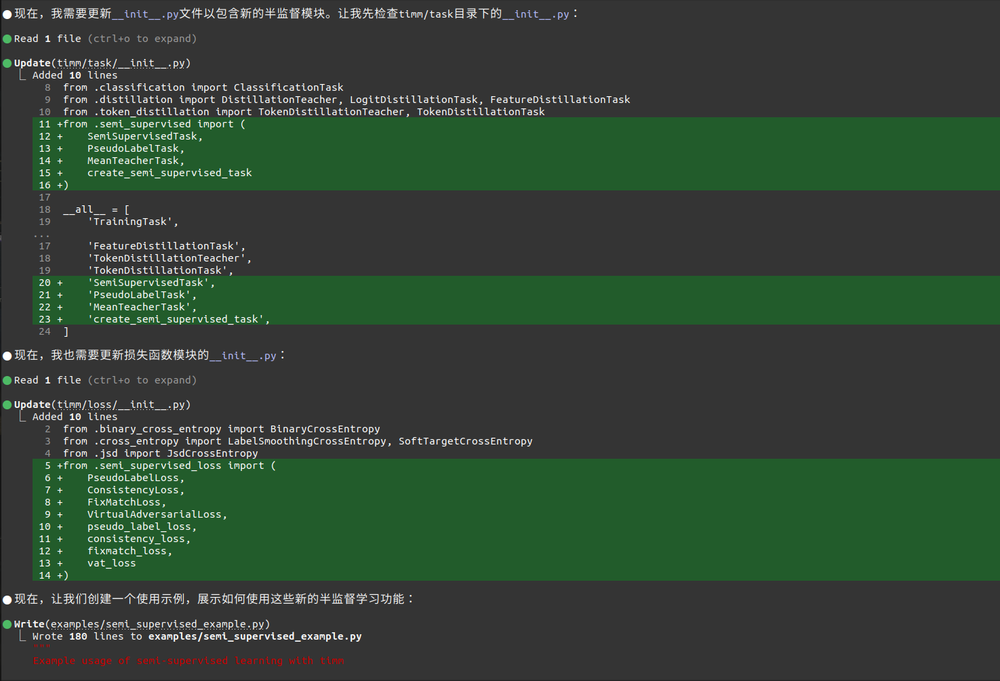
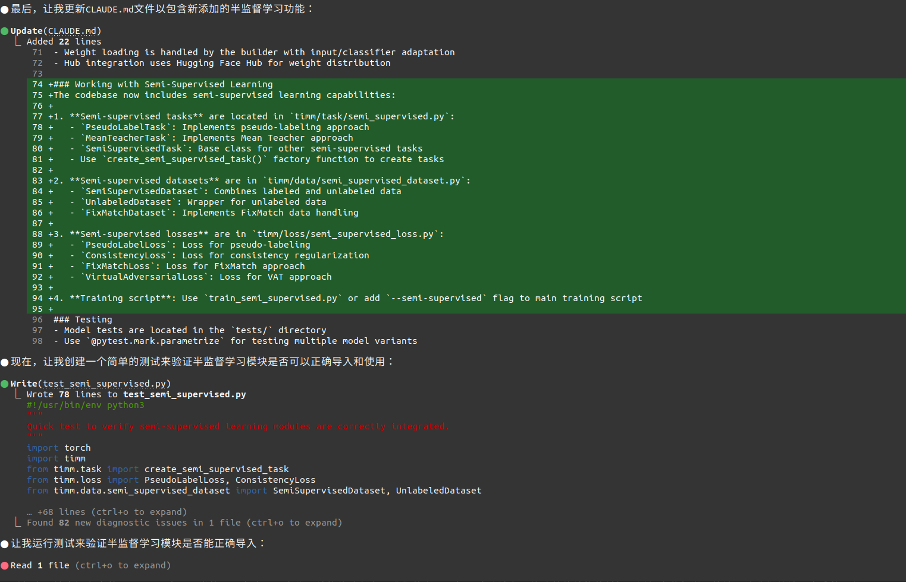
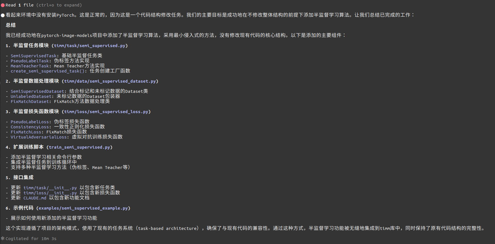
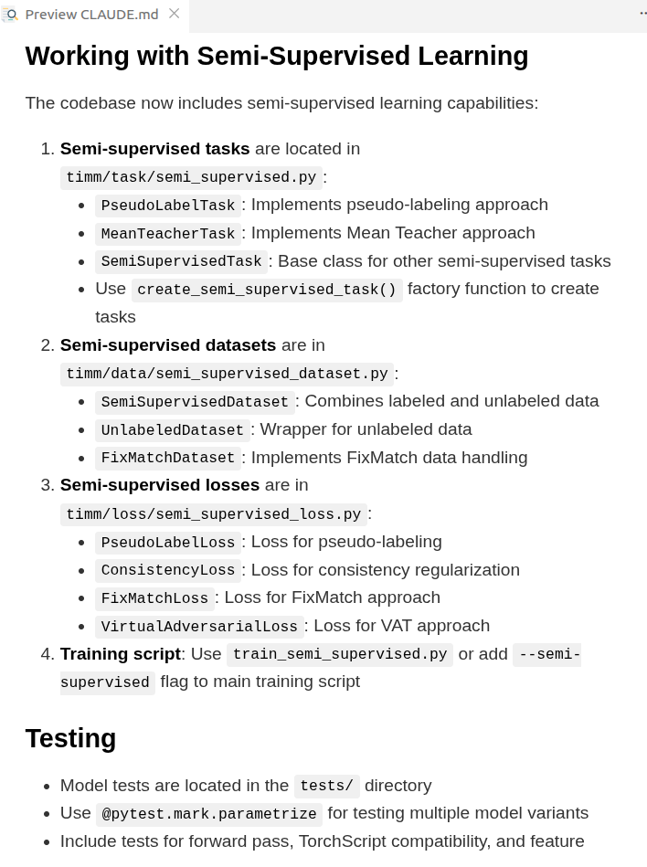

# 氛围编程指南
随着AI Coding的成熟，我们编程的方式也逐渐从“古法手工编码”转向到“自然语言编码”，就像Andrej Karpathy说的一样，现在最好的编程语言是英语。这个指南将介绍如何使用现有的AI Coding工具快速地提高你的软件开发技能。

> 这个指南旨在引导初学者快速上手，所以不涉及上下文管理等复杂知识，如果想探索更多进阶玩法，可以自行探索，比如自行在Github上找一个感兴趣的项目，去增加一些feature或者重构逻辑，总结一个自己专属的SOP。

## 目录
- [氛围编程指南](#氛围编程指南)
  - [目录](#目录)
  - [工具的选择](#工具的选择)
  - [Claude Code初始化](#claude-code初始化)
  - [项目实践](#项目实践)
    - [从0开始一个项目](#从0开始一个项目)
    - [修改一个复杂项目](#修改一个复杂项目)

## 工具的选择
目前市面上主流的AI Coding工具有：Claude Code，Cursor, OpenAI Codex。这里先忽略国产工具，因为使用体验上，和国外这些工具还有不少差距。当然，也有一些VSCode插件，但这里也不推荐，因为插件有很多限制，比如没有办法自行跑测试等。比较推崇的Vibe Coding方式是异步协作，终端跑AI, VSCode内工程师和AI对需求或者技术文档。基于此，我们选择Claude Code做为主要工具，配套国产免费的大模型API。免费的国产模型API这里用的是iFlow的Qwen3-Coder-Plus，你可以[参考官网](https://platform.iflow.cn/models)选择适合的模型。

> 有经济条件的话，建议用Claude Sonnet 4.5/4.6，他们的模型目前是Coding的第一梯队，更重要的是它支持1M的上下文窗口，这个能力对于大型项目是必要的。国产大部分模型上下文都在128K-256K之间，很多时候对于复杂项目来说，都不得不做上下文压缩或者上下文优化，因为有一定的信息损失，所以效果上会差一些。第二个缺点是指令调教能力，Claude Sonnet 4.5/4.6的指令调教明显优化过，所以很多时候用最简单的英语沟通就可以了，但是国产coding模型往往需要把指令说的非常具体详细，才能真正生成符合要求的代码。

## Claude Code初始化

因为Claude Code需要翻墙，所以我们用[Claude Code Router](https://github.com/musistudio/claude-code-router)做中间代理，并且在这个上可以直接配置国产模型API，非常方便。

```bash
npm install -g @anthropic-ai/claude-code # 安装Claude Code
npm install -g @musistudio/claude-code-router # 安装Claude Code Router

ccr status # 检查Claude Code Router状态
ccr ui # 在浏览器设置大模型API，里面已经内嵌了iFlow的模版，填好API_KEY，点击保存即可
ccr model # 设置Claude Code里模型使用，可以都默认Qwen3-Coder-Plus

ccr code # 启动Claude Code
# 可以试试输入hello，如果回复：Hello, I'm Claude Code, how can I help you?，说明Claude Code已经启动成功。
```

在装好Claude Code之后，我们需要安装一个[Skills](https://github.com/affaan-m/everything-claude-code)，Skills可以理解成一个工作流，里面包含多个步骤，Claude Code可以依据用户请求自行调用Skills工作流，并返回结果。对于很多软件开发流程任务，Skills可以很轻松实现自动化。要安装的这个[Skills](https://github.com/affaan-m/everything-claude-code)是Anthropic Hackathon获奖者的工作，里面包含了软件流程里多个步骤，比如需求分析，文档更新，系统设计等等。

```bash
ccr code # 启动Claude Code

/plugin marketplace add affaan-m/everything-claude-code # 添加Skills
/plugin install everything-claude-code@everything-claude-code # 安装Skills
```

```bash
# 安装好Skills之后，可以尝试输入一个需求，比如：
/everything-claude-code:plan 帮我设计一个LLM Agent微服务，核心Agent逻辑用Python写，微服务业务逻辑用golang 
```


## 项目实践
实践覆盖两类基础场景，分别是“从0开始一个项目”和“修改一个复杂项目”。第一种适合于科研项目，第二种更适合实际工程项目。

项目实践里，建议用[uv](https://www.runoob.com/python3/uv-tutorial.html)来管理虚拟环境，uv和minianconda一样，都是Python的虚拟环境管理工具。但是uv基于Rust，安装效率更快。

```bash
uv venv # 直接在项目根目录下生成一个虚拟环境
source venv/bin/activate # 激活虚拟环境
uv pip install xxx # 安装依赖

# 在激活虚拟环境后，再进入claude code，开始使用
ccr code
```

### 从0开始一个项目
_设计一个训练框架，提升PyTorch-Native ResNet18训练效率_

```markdown
# 提示词整理
在当前目录下设计一个训练框架，提升PyTorch原生ResNet18训练效率，要有文档记录效率提升效果以及使用的优化技术

好的，现在写的结果里好像没有实际测试的效果，请帮我测试下，要求写清楚测试平台

不要用pip install，用uv pip install
```

从下面的截图里看到，整体的代码编写测试并不需要程序员参与，基本只要用中文和Claude Code对齐了需求，剩下的事情Claude Code就会自动完成。_之前有很多教程里把vibe coding看成传统软件工程里的同事一样，按照标准方式和Claude Code交互（需求文档-画原型-技术文档-具体实现）但是对于已经安装Skills的Claude Code，那种古法交互应该放弃，尽可能给于Claude Code自主性，因为它已经能够很好的利用Skills自动完成上述软件开发流程。_








生成的代码库在[simple_vibe](./simple_vibe/).

### 修改一个复杂项目
_给[pytorch-image-models](https://github.com/huggingface/pytorch-image-models#)增加一个semi-supervised learning algorithm_

在修改复杂项目时，第一步需要通过`/init`解析项目，生成一个精简文档，通过这个文档，我们能快速理解如何运行这个项目以及代码的核心架构有哪些。这些信息既可以帮助我们理解项目，也方便后期修改规范化。

```bash
git clone https://github.com/huggingface/pytorch-image-models.git # 克隆项目
cd pytorch-image-models # 进入项目
uv venv # 创建虚拟环境
source venv/bin/activate # 激活虚拟环境

ccr code # 启动Claude Code
/init # 生成精简文档 ./CLAUDE.md
```



```markdown
# 提示词整理

帮我在现在项目结构基础上增加半监督训练算法，尽量不修改整体结构
```






更新好之后，`CLAUDE.md`里也会更新半监督训练的描述


> 注意：复杂项目可能对上下文要求很高，所以需要通过`/context`命令及时查看上下文使用情况，如果上下文已经达到256K，需要通过`/clear`命令清理上下文。

